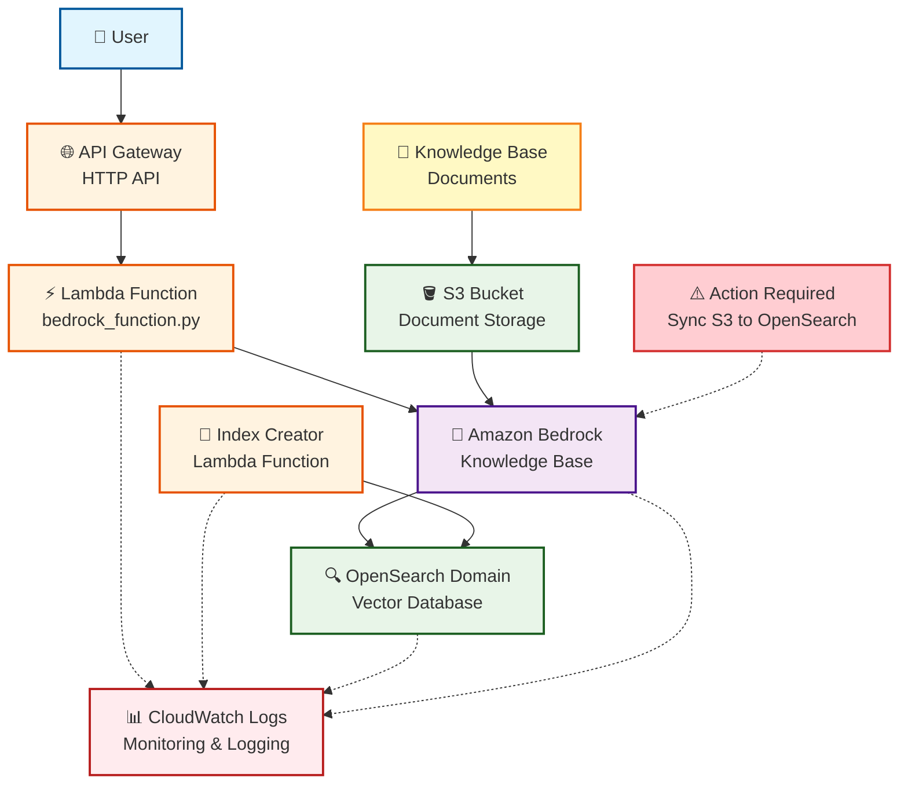
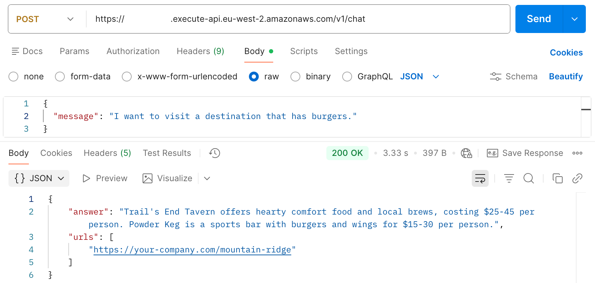
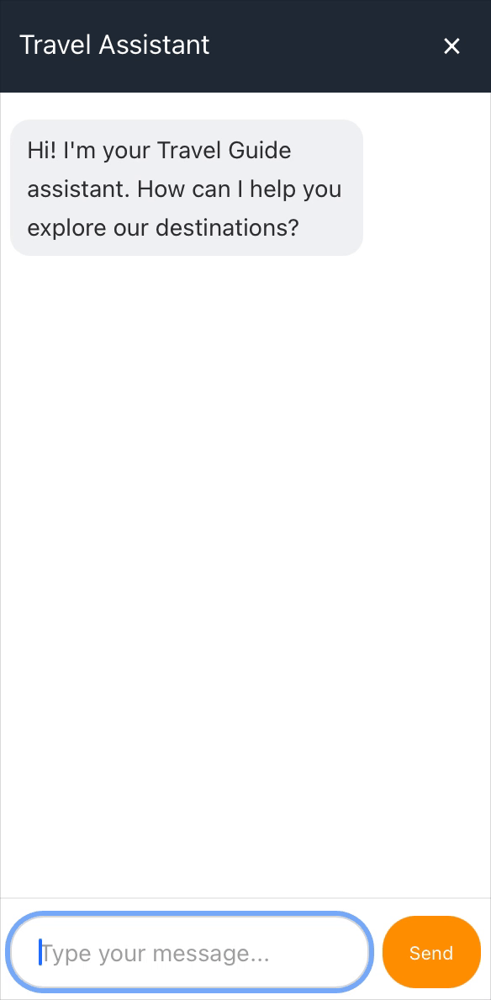
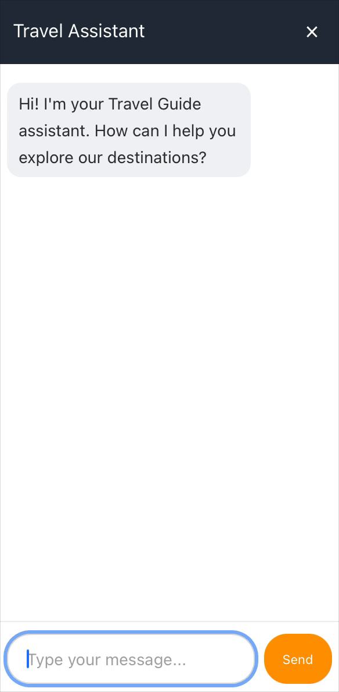

# RAG Knowledge Base

A production-ready Retrieval-Augmented Generation (RAG) system built on AWS that combines Amazon OpenSearch, Bedrock, and Lambda to create an intelligent knowledge base with conversational AI capabilities.

## Table of Contents

- [Overview](#overview)
- [Visual Documentation](#visual-documentation)
- [Quick Start](#quick-start)
- [Project Structure](#project-structure)
- [Documentation](#documentation)
- [Versioning](#versioning)
- [License](#license)

## Overview

### Core Components
- **Amazon OpenSearch Service**: Vector database for document embeddings
- **AWS Lambda**: Serverless functions for index creation and chat API
- **Amazon API Gateway**: HTTP API with chat endpoint
- **Amazon Bedrock**: Knowledge base with foundation models for RAG
- **Amazon S3**: Document storage

### Key Features
- Configuration-driven deployment across multiple environments
- Multi-AZ support for high availability
- Comprehensive monitoring and logging
- Secure, production-ready infrastructure

### Infrastructure Diagram



## Visual Documentation

</br>




## Quick Start

### Prerequisites
- AWS CLI configured with appropriate permissions
- Make utility installed
- S3 bucket with your documents
- Cognito User Pool and App Client (if enabling authorization)

### Deployment

1. **Configure your environment**:
   ```bash
   cp config/config.example.env config/config.<environment>.env
   # Edit config.<environment>.env with your settings
   ```

2. **Deploy the complete stack**:
   ```bash
   make all ENV=<environment>
   ```

3. **Get your API endpoint**:
   ```bash
   make api-endpoint ENV=<environment>
   ```

4. **⚠️ Manual Sync Required**: After deployment, manually sync your S3 documents to the Bedrock Knowledge Base using AWS Console or AWS CLI.

### Usage

**With Cognito Authorization (when enabled):**
```bash
curl -X POST https://your-api-id.execute-api.region.amazonaws.com/chat \
  -H 'Authorization: Bearer <ACCESS_TOKEN>'
  -H "Content-Type: application/json" \
  -d '{"message": "What is the main topic of the documentation?"}'
```

**Without Authorization (when disabled):**
```bash
curl -X POST https://your-api-id.execute-api.region.amazonaws.com/chat \
  -H "Content-Type: application/json" \
  -d '{"message": "What is the main topic of the documentation?"}'
```

**Response Format:**
```json
{
  "answer": "Based on the documentation, the main topic is...",
  "urls": [
    "https://your-docs-site.com/document1",
    "https://your-docs-site.com/document2"
  ]
}
```

## Project Structure

```
rag-knowledge-base/
├── config/
│   └── config.example.env    # Configuration template
├── docs/                     # Extended documentation
│   ├── ARCHITECTURE.md       # Technical architecture details
│   ├── CONFIGURATION.md      # Configuration guide
│   ├── DEPLOYMENT.md         # Deployment instructions
│   └── MONITORING.md         # Monitoring and observability
├── functions/
│   └── bedrock_function.py   # Lambda chat handler
├── img/                      # Visual documentation
├── .gitignore
├── LICENSE
├── Makefile                  # Deployment automation
├── README.md                 # This file
├── template.yaml             # CloudFormation infrastructure
└── VERSION                   # Version tracking
```

## Documentation

For detailed information, see the extended documentation:

- **[Architecture](docs/ARCHITECTURE.md)**: Technical implementation details, service flows, and security features
- **[Configuration](docs/CONFIGURATION.md)**: Complete configuration guide with examples for different environments
- **[Deployment](docs/DEPLOYMENT.md)**: Deployment instructions, available commands, and troubleshooting
- **[Monitoring](docs/MONITORING.md)**: Observability setup, log groups, and monitoring best practices

## Versioning

This project follows [Semantic Versioning](https://semver.org/) (SemVer):
- **MAJOR**: Breaking changes to API, configuration, or infrastructure
- **MINOR**: New features, configuration options, or AWS service additions
- **PATCH**: Bug fixes, security patches, or documentation updates

Version information is maintained in the `VERSION` file and `CHANGELOG.md`.

## License

This project and all its source code are proprietary software. All rights are reserved.  
Unauthorized copying, modification, distribution, or use of this project is strictly prohibited.

Copyright (c) 2025 Christopher Royall  
[https://chrisroyall.com](https://chrisroyall.com)