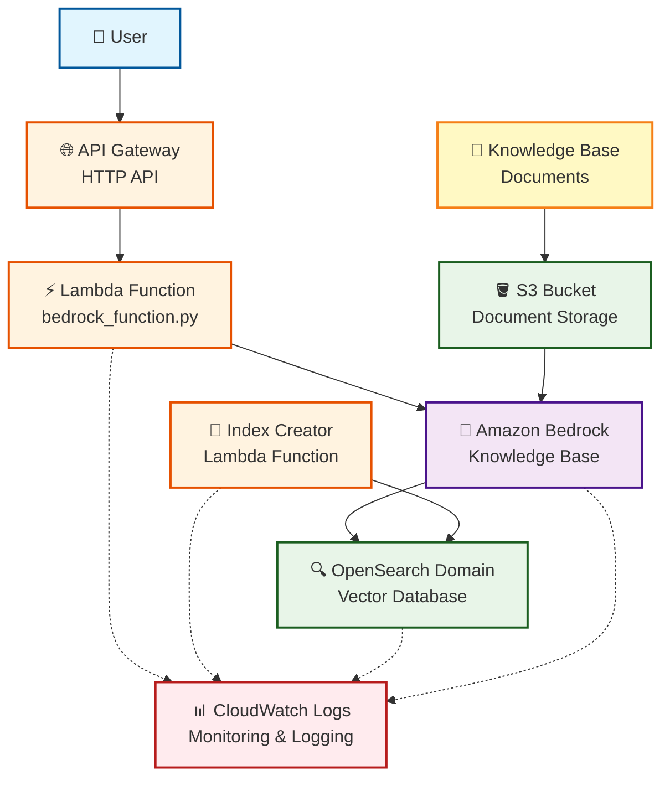

# Architecture Documentation

## Infrastructure Diagram



## AWS Services Implementation

This system deploys a complete RAG pipeline using the following AWS services:

### Core Infrastructure Services
- **Amazon OpenSearch Service**: Managed vector database for storing document embeddings with configurable multi-AZ deployment
- **AWS Lambda**: Two serverless functions handling index creation and chat API processing
- **Amazon API Gateway**: HTTP API providing chat endpoint with CORS support and throttling
- **Amazon S3**: Document storage for knowledge base content (bucket must exist before deployment)

### AI/ML Services
- **Amazon Bedrock Knowledge Base**: Automated document ingestion, vectorization, and retrieval using foundation models
- **Amazon Bedrock Data Source**: S3 integration with configurable chunking strategy (512 tokens, 20% overlap)
- **Foundation Models**: 
  - Embedding model (default: `amazon.titan-embed-text-v2:0`) for text vectorization
  - Generation model (default: `anthropic.claude-3-7-sonnet-20250219-v1:0`) for response generation

### Supporting Services
- **AWS CloudFormation**: Infrastructure as Code deployment and management
- **Amazon CloudWatch**: Comprehensive logging and monitoring across all components
- **AWS IAM**: Fine-grained security roles and policies for service interactions

## Critical Implementation Details

### OpenSearch Index Creation
The OpenSearch index **cannot be created directly via CloudFormation** due to AWS service limitations. Instead, the system uses a custom Lambda function (`IndexCreatorFunction`).

### Multi-AZ Configuration Validation
The CloudFormation template includes built-in validation:
- When `OPEN_SEARCH_ZONE_AWARENESS_ENABLED=true`, instance count must be ≥2
- Supports three deployment modes: Single-AZ, Multi-AZ, Multi-AZ with Standby

## Service Flow and Data Processing

### 1. Document Ingestion Flow
```
S3 Documents → Bedrock Knowledge Base → Embedding Model Processing → Vector Storage in OpenSearch Index
```

**Detailed Steps:**
1. Documents uploaded to S3 bucket (must be done manually or via separate process)
2. Bedrock Knowledge Base Sync triggered automatically
3. Bedrock Data Source reads documents from S3
4. Documents chunked into 512-token segments with 20% overlap
5. Embedding model converts text chunks to 1024-dimensional vectors
6. Vectors stored in OpenSearch with metadata and original text

### 2. Query Processing Flow
```
User Question → API Gateway → Lambda Function → Bedrock Knowledge Base → OpenSearch Vector Search → Context Retrieval → LLM Generation → Response
```

**Detailed Steps:**
1. User sends POST request to `/chat` endpoint with JSON payload: `{"message": "question"}`
2. API Gateway validates request and forwards to Lambda function
3. Lambda function (`bedrock_function.py`) processes the request:
   - Validates input and applies system prompt with chatbot personality
   - Calls Bedrock `retrieve_and_generate` API
4. Bedrock Knowledge Base performs vector similarity search in OpenSearch
5. Retrieved context combined with user question sent to generation model
6. LLM generates response with source citations
7. Lambda processes citations, converts S3 URIs to public URLs
8. Response returned as JSON: `{"answer": "response", "urls": ["source1", "source2"]}`

### 3. Infrastructure Deployment Flow
```
CloudFormation Template → Resource Creation → Index Creator Lambda Execution → OpenSearch Index Setup → Bedrock Knowledge Base Sync → Update Lambda Function Code → Fetch API Endpoint
```

**Detailed Steps:**
1. CloudFormation deploys all AWS resources (IAM roles, OpenSearch domain, Lambda functions, API Gateway)
2. Index Creator Lambda automatically executes as Custom Resource
3. Creates optimized OpenSearch index with proper vector field mappings
4. Bedrock Knowledge Base configured to use the created index
5. Bedrock Knowledge Base automatically syncs S3 documents during deployment
6. All services connected with appropriate IAM permissions

## Security Features

- **Encryption**: Data encrypted at rest and in transit (TLS 1.2+)
- **IAM Roles**: Fine-grained permissions for each service
- **HTTPS Only**: API Gateway enforces HTTPS
- **Optional JWT Authorization**: Cognito-based authentication for API access
- **CloudWatch Logging**: Comprehensive audit trails
- **Resource-level Access Control**: Specific permissions for OpenSearch and Bedrock resources
- **No Public Access**: OpenSearch domain accessible only via IAM roles